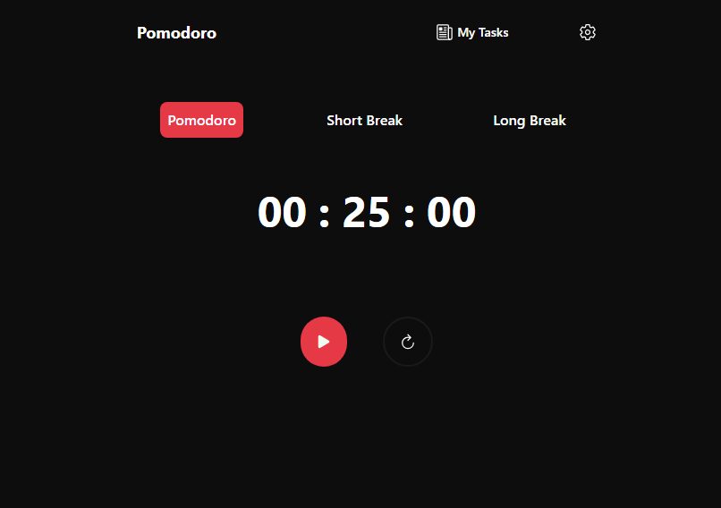

# Pomodoro

A simple app that helps you manage your time when doing tasks.

## Tech Stack

**Client:** HTML, CSS, JavaScript, React, TailwindCSS, Web Storage API

## Screenshots

## Lessons Learned

While doing the project I've encountered new advanced concepts in react that was the Context API and the Custom Hooks. I've learned that we can use Context API to share a global state that can be shared between multiple components and custom hooks for making functions and states more maintanable especially when building complex apps.

Also while reading the documentation of Context API it also suggest that it minimize prop drilling which was a new term for me when I encountered it, and upon checking my previous projects I've been using prop drilling in my projects.

This terms would be useful for me in the future projects that I'm going to build since I find it difficult to maintain props if the layers become to deep like passing props from parent > children > grandchildren > etc,. For custom hooks the advantage is that I can write cleaner code and hooks that provide more context on what the code does.

## The Challenges

I’ve found these concepts to be quite tricky, especially when using Context sometimes I tend to overuse it where some state declaration can be done in more simpler ways, but I’m committed to mastering them.

I believe that by practicing and studying these topics, I’ll become more proficient in building efficient and maintainable React applications.

## Acknowledgements

These lists of documentation are what I'm currently using:

- [React](https://react.dev/)
- [MDN Web Docs](https://developer.mozilla.org/)
- [W3Schools](https://www.w3schools.com/)

For video tutorials:

- [@WebDevSimplified](https://www.youtube.com/c/webdevsimplified)
